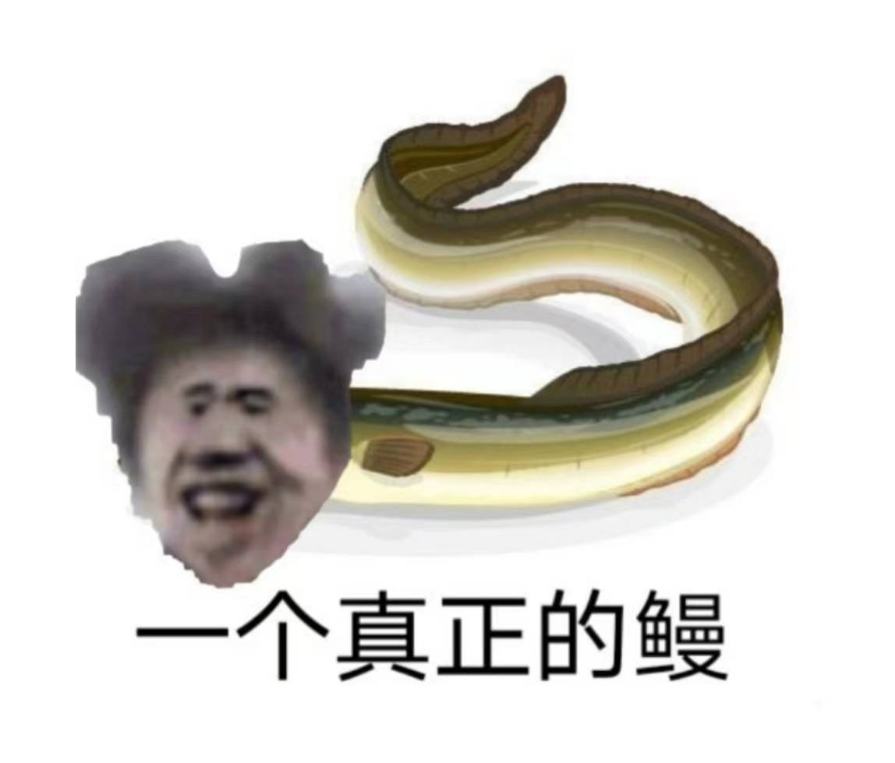

- [坤吧管理系统](#------)
    * [环境部署](#----)
    * [技术选型？？？（唱跳rap篮球music）](#----------rap--music-)
    * [编码规范](#----)
    * [Dockerfile镜像的一些坑](#dockerfile------)
        + [openjdk:8-jdk-alpine过于精简？](#openjdk-8-jdk-alpine-----)
# 坤吧管理系统🐥

> 全民制作人大家好我是练习时常两年半（一坤年）的只因练习生坤坤。</br>
> 为了方便真爱粉（你干嘛哎呦），防止虾头男。应该有一个小黑子管理系统！！！</br>
> 适当玩梗，有一说一kun挺大方的</br>

> keywords(关键词): 小黑子、java、spring、mysql、毕业设计

<div align="center">

</div>


1. 卤出鸡脚了吧!
2. 树枝666，小黑子 苏珊，食不食油饼？
3. 耗丸吗？
4.  再黑紫砂吧！
5.  4年前的梗你们还在玩，4年前的剩饭你们怎么不吃？
6.  臻果粉！我看你们都馍蒸了！
7.  蒸梅油酥汁！
8.  你们犯法了知道吗？
9. 你们再这样我就煲胫了！
10.  香精煎鱼是吗？
11.  香翅捞饭是吗？
12.  真没有荚饺，
13.  荔枝？
14.  你要我怎么荔枝！？
15. 据野史记载，唐高宗李治吃饭，饭桌上有虾头，鸡，油饼，果粉。常常对身边的扇扇子的说“速扇”。饭后还要吃一个甜品，荔枝味的酥山。厨子为了做这一顿饭，拿姜拿到手软，担心柴火不够时，经常问“有没有树枝啊”
16. 你这么黑他，你知道我们家坤坤有多努力吗？ 你知道他这两年半的练习时间是怎么度过的吗？你们这些小黑子不知道，只知道黑他，所以说鸡到底有多美？
17. 挖什么金矿？
## 环境部署

- [x] jdk1.8
- [x] mysql8.0
- [x] docker
- [x] redis
1. 不想搭建可以让别人给搭建(既然最求刺激那就贯彻到底喽)
2. **dockerfile使用之前记得修改一下docker的配置文件**

## 技术选型

不想写（你知道他多努力吗？）

## 编码规范

一个真正的鳗不需要规范，要啥自行车，写注释多累人啊！！
数据库表前缀也不要写 那就可以随时删除跑路了😀
## 结构层级
```bash
C:.
└─src
     ├─main
     │  ├─java
     │  │  └─com
     │  │      └─ctrl
     │  │          ├─config
     │  │          ├─controller
     │  │          │  ├─login
     │  │          │  └─user
     │  │          ├─dao
     │  │          ├─entity
     │  │          ├─exception
     │  │          ├─service
     │  │          └─utils
     │  └─resources
     └─test
        └─java
```
## 测试类
听我的测试类没用，屎山代码需要测试？

## Dockerfile镜像的一些坑

### openjdk:8-jdk-alpine过于精简？

```bash
java.lang.NoClassDefFoundError: Could not initialize class sun.awt.X11FontManager
```

这个错误一般出现在生成验证码绘制的时候，这个错误大概原因就是由于在alpine上太过于精简了，导致初始化FontManagerFactory工厂初始化失败，那么解决办法就是安装glibc。